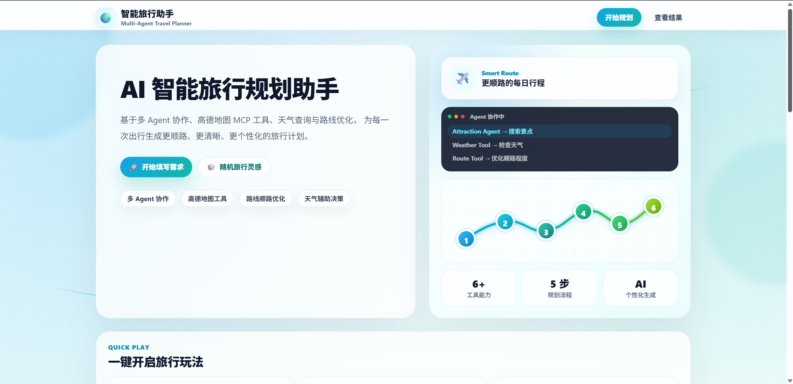
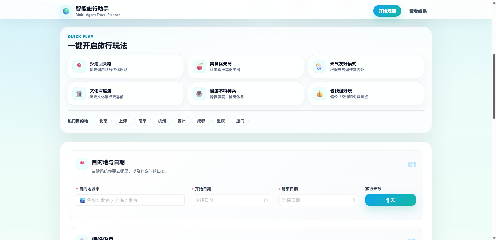
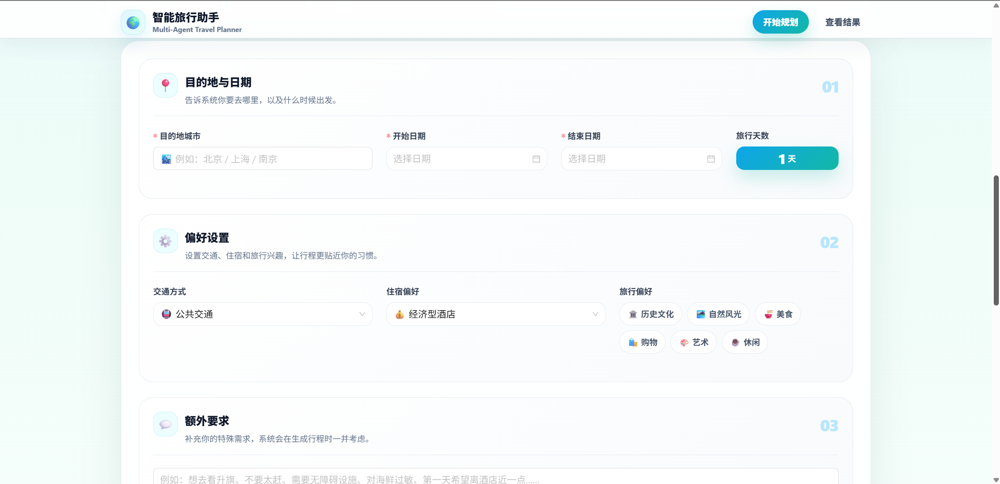
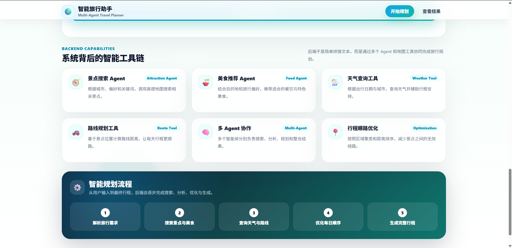
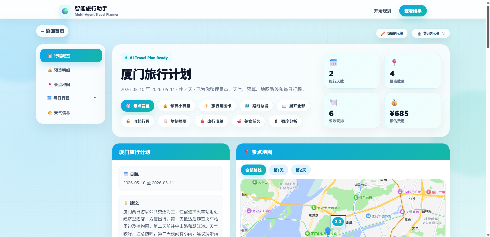
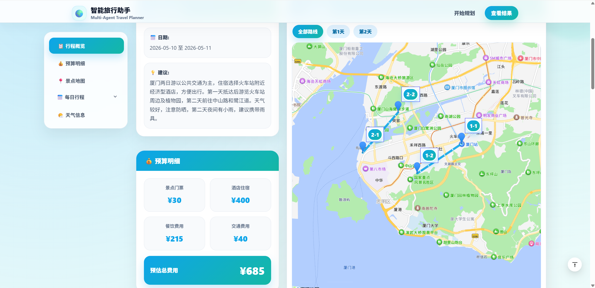
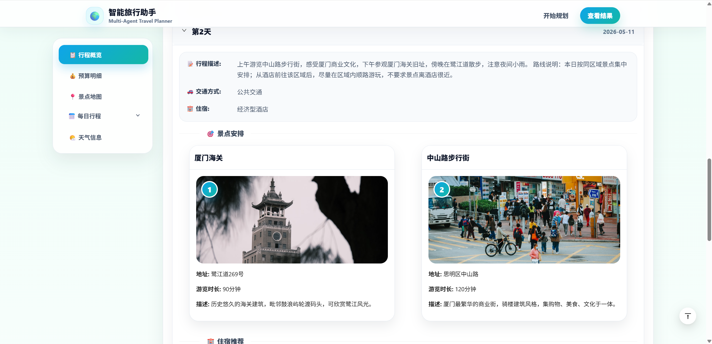
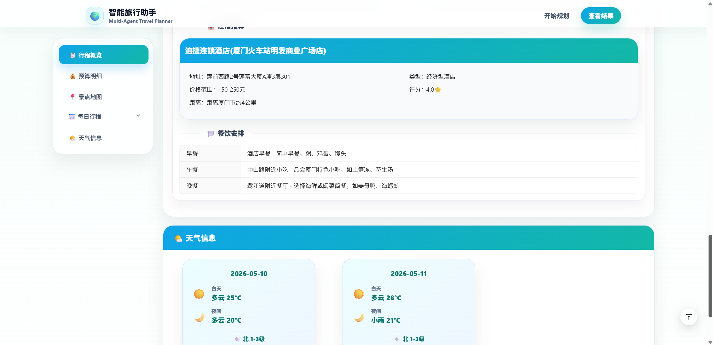
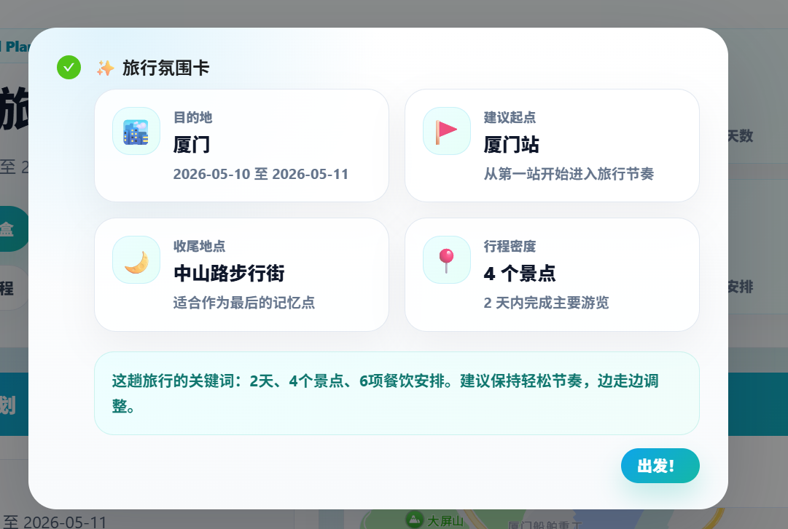

# 🌍 基于 LangGraph 的智能旅行规划助手

<div align="center">



<br/>

**基于 LangGraph + FastAPI + Vue3 + TypeScript 的 AI 智能旅行规划系统**

从用户输入出发，自动完成旅行画像解析、景点搜索、天气查询、酒店推荐、路线优化、规则检索、行程生成与反思校验。

<br/>

</div>

---

## ✨ 项目简介

**智能旅行规划助手** 是一个面向 AI Agent 工程学习的完整前后端项目。

用户只需要在前端填写目的地、出行日期、旅行天数、交通方式、住宿偏好、旅行兴趣和额外要求，系统就会通过后端 LangGraph Agent 流程自动生成一份结构化旅行计划。

它不是简单地把用户输入丢给大模型，而是将旅行规划拆成多个明确步骤：

```text
用户需求
  ↓
Trip Profile 本次旅行画像
  ↓
景点搜索
  ↓
天气查询
  ↓
酒店搜索
  ↓
路线优化
  ↓
旅行规则检索
  ↓
LLM 生成行程
  ↓
Reflection 检查修正
  ↓
结构化结果返回前端
```

---

## 🧭 项目效果预览

### 🏠 首页与旅行需求填写

<div align="center">



</div>

<br/>

首页包含快捷玩法、热门目的地、目的地与日期设置等模块。用户可以快速填写旅行城市、开始日期、结束日期和旅行天数。

<div align="center">



</div>

<br/>

用户可以进一步选择交通方式、住宿偏好、旅行偏好，并填写额外要求，例如“不想太累”“第一天希望酒店近一点”“想多看博物馆”等。

---

### 🧠 系统能力展示

<div align="center">



</div>

<br/>

项目不是单一 LLM 文本生成，而是通过多个后端能力协同完成旅行规划：

- 🧭 景点搜索 Agent
- 🍜 美食推荐 Agent
- 🌦️ 天气查询工具
- 🚗 路线规划工具
- 🧠 多 Agent 协作
- 📍 行程顺路优化

---

### 📋 旅行计划结果页

<div align="center">



</div>

<br/>

生成结果页会展示旅行计划概览，包括：

- 📅 旅行天数
- 📍 景点数量
- 🍽️ 餐饮安排
- 💰 预算费用
- 🗺️ 景点地图
- 📋 每日行程

---

### 🗺️ 地图路线与预算展示

<div align="center">



</div>

<br/>

地图模块会展示每天景点点位和路线顺序，预算模块会拆分展示景点门票、酒店住宿、餐饮费用和交通费用。

---

### 🎯 每日景点安排

<div align="center">



</div>

<br/>

每日行程中会展示景点卡片，包括景点名称、图片、地址、游览时长和景点描述。

---

### 🏨 酒店、餐饮与天气信息

<div align="center">



</div>

<br/>

结果页还会展示住宿推荐、早中晚餐安排和每日天气信息，帮助用户更完整地理解行程。

---

### ✨ 旅行氛围卡

<div align="center">



</div>

<br/>

旅行氛围卡会总结本次旅行的关键信息，例如目的地、起点、收尾地点、行程密度和旅行关键词。

---

## 🚀 核心功能

### 🧠 1. LangGraph 多节点旅行规划流程

项目使用 LangGraph 将旅行规划拆解为多个节点，每个节点负责一个明确任务。

```text
START
  ↓
trip_profile
  ↓
search_attractions
  ↓
search_weather
  ↓
search_hotels
  ↓
route_optimizer
  ↓
travel_rules
  ↓
generate_plan
  ↓
reflection_check
  ↓
validate_plan
  ↓
END
```

| 节点 | 作用 |
|---|---|
| `trip_profile` | 解析本次旅行画像，生成搜索关键词 |
| `search_attractions` | 根据关键词搜索候选景点 |
| `search_weather` | 查询目的地天气 |
| `search_hotels` | 搜索候选酒店 |
| `route_optimizer` | 根据距离和路线耗时优化每日景点顺序 |
| `travel_rules` | 检索通用旅行规则 |
| `generate_plan` | 调用 LLM 生成完整旅行计划 |
| `reflection_check` | 检查并修正初版计划 |
| `validate_plan` | 校验结构，失败时启用兜底计划 |

---

### 🧳 2. Trip Profile 本次旅行画像解析

系统会先根据用户输入解析本次旅行画像，而不是直接生成行程。

Trip Profile 会分析：

- 👥 出行人群：独自、朋友、情侣、父母、亲子等
- 🏃 旅行强度：轻松、正常、紧凑
- 💰 预算等级：低预算、中等预算、高预算
- 🎯 主题偏好：历史文化、博物馆、美食、自然风光、夜景等
- 🚶 行程约束：减少长距离步行、避免太累、不要过满等
- 🔍 搜索关键词：用于后续 POI 搜索

这样可以让后续搜索和规划更贴近用户当前需求。

---

### 📍 3. 高德地图 POI 与路线能力接入

后端封装了高德地图相关能力，包括：

- 🔍 POI 搜索
- 🌦️ 天气查询
- 🚗 路线规划
- 🏨 酒店搜索
- 📌 POI 详情查询
- 📏 景点距离计算
- 🗺️ 景点顺路排序

系统尽量使用真实地图数据辅助生成行程，减少大模型凭空编造地点的问题。

---

### 🗺️ 4. 区域化路线优化

项目中实现了路线优化逻辑，不只是依赖大模型“自己觉得顺路”。

路线优化会做这些事情：

- 剔除离核心区域太远的异常景点
- 按地理距离将景点分组
- 每天尽量安排同一区域或相邻区域景点
- 第一天优先选择靠近推荐酒店的景点区域
- 后续天数不强求离酒店近，但要求当天景点之间顺路
- 使用路线耗时或距离进行排序
- 最终强制重排旅行计划中的景点顺序

这样可以减少“景点都不错，但路线很乱”的问题。

---

### 📚 5. 通用旅行规则检索

项目提供了轻量级旅行规则检索能力。

后端会从：

```text
backend/app/knowledge_base/travel_rules.md
```

中读取旅行规则，并根据用户偏好、额外要求和天气信息检索相关规则。

例如：

- 🌧️ 雨天减少户外景点
- 🥵 高温天气避免下午长时间户外活动
- 👵 老人出行降低强度
- 👨‍👩‍👧 亲子出行安排更轻松
- 🏛️ 博物馆适合上午或下午前半段
- 🌃 夜景、夜市适合晚餐后安排
- ⛰️ 山岳类景点不宜和过多高强度步行景点放在同一天

当前实现是 **关键词规则检索**，不是完整向量 RAG，但已经具备规则增强生成效果。

---

### 🧐 6. Reflection 行程反思检查

初版旅行计划生成后，系统会进入 Reflection 检查节点。

Reflection 会重点检查：

- 每天景点数量是否合理
- 用户要求轻松时，行程是否过满
- 雨天是否安排太多户外景点
- 高温天气是否安排太多下午户外活动
- 博物馆、美术馆、展览馆是否安排合理
- 夜景、夜市、古街是否适合安排在晚餐后
- 同一天景点是否尽量同区域，避免来回折返
- 是否包含早中晚三餐
- 是否包含酒店、预算、天气信息
- 是否满足用户偏好和额外要求
- JSON 字段结构是否完整

如果发现问题，Reflection 会尝试返回修正后的旅行计划。

---

### 🛟 7. 异常兜底计划

如果 LLM 输出格式错误、JSON 解析失败、字段校验失败，系统不会直接崩溃，而是启用兜底计划。

兜底计划会根据已有的候选景点、酒店、天气和用户请求生成一个基础行程，保证前端仍然可以拿到可展示的数据。

---

### 🖼️ 8. 景点图片搜索优化

POI 图片接口支持：

- 使用 LLM 将中文景点名转换为英文 Unsplash 搜索词
- 根据景点类型生成兜底搜索词
- 搜索词去重
- 图片结果缓存
- 避免反复请求 LLM 和 Unsplash

例如：

```text
城市：南京
景点：南京博物院
```

可能生成：

```json
["Nanjing Museum", "Nanjing China museum", "Nanjing architecture", "China museum"]
```

---

## 🛠️ 技术栈

### 🐍 后端

| 技术 | 作用 |
|---|---|
| Python | 后端主要语言 |
| FastAPI | 提供后端 API 接口 |
| Uvicorn | 启动 ASGI 服务 |
| Pydantic | 请求与响应数据校验 |
| LangGraph | 构建多节点 Agent 工作流 |
| LangChain Messages | 组织 LLM 对话消息 |
| HelloAgents | LLM 与工具调用基础封装 |
| 高德地图 API / MCP | POI、天气、路线能力 |
| Unsplash API | 景点图片搜索 |
| python-dotenv | 环境变量管理 |

### 🎨 前端

| 技术 | 作用 |
|---|---|
| Vue 3 | 前端框架 |
| TypeScript | 类型约束 |
| Vite | 前端构建工具 |
| Ant Design Vue | UI 组件库 |
| Axios | 请求后端接口 |
| 高德地图 Web JS API | 地图展示 |

---

## 📁 项目结构

```text
helloagents-trip-LangGrap
├── asset
│   ├── 1.png
│   ├── 2.png
│   ├── 3.png
│   ├── 4.png
│   ├── 5.png
│   ├── 6.png
│   ├── 7.png
│   ├── 8.png
│   └── 9.png
│
├── backend
│   ├── app
│   │   ├── agents
│   │   │   ├── __init__.py
│   │   │   └── langgraph_trip_planner_agent.py
│   │   │
│   │   ├── api
│   │   │   ├── routes
│   │   │   │   ├── __init__.py
│   │   │   │   ├── map.py
│   │   │   │   ├── poi.py
│   │   │   │   └── trip.py
│   │   │   ├── __init__.py
│   │   │   └── main.py
│   │   │
│   │   ├── knowledge_base
│   │   │   └── travel_rules.md
│   │   │
│   │   ├── models
│   │   │   ├── __init__.py
│   │   │   └── schemas.py
│   │   │
│   │   ├── rules
│   │   │   ├── __init__.py
│   │   │   └── travel_rules.py
│   │   │
│   │   ├── services
│   │   │   ├── __init__.py
│   │   │   ├── amap_service.py
│   │   │   ├── llm_service.py
│   │   │   └── unsplash_service.py
│   │   │
│   │   ├── __init__.py
│   │   └── config.py
│   │
│   ├── .env
│   ├── .env.example
│   ├── requirements.txt
│   └── run.py
│
├── frontend
│   ├── src
│   │   ├── services
│   │   │   └── api.ts
│   │   │
│   │   ├── types
│   │   │   └── index.ts
│   │   │
│   │   ├── views
│   │   │   ├── Home.vue
│   │   │   └── Result.vue
│   │   │
│   │   ├── App.vue
│   │   ├── main.ts
│   │   └── vite-env.d.ts
│   │
│   ├── .env
│   ├── .env.example
│   ├── index.html
│   ├── package.json
│   ├── package-lock.json
│   ├── tsconfig.json
│   └── vite.config.ts
```

---

## 🔄 系统完整调用流程

```text
1. 用户打开前端首页
        ↓
2. 用户填写旅行表单
        ↓
3. Home.vue 调用 services/api.ts
        ↓
4. api.ts 发送 POST /api/trip/plan 请求
        ↓
5. FastAPI 进入 routes/trip.py
        ↓
6. trip.py 调用 LangGraphTripPlanner
        ↓
7. LangGraph 按节点执行旅行规划
        ↓
8. 生成 TripPlan
        ↓
9. FastAPI 包装成 TripPlanResponse
        ↓
10. 前端 Result.vue 展示旅行计划
```

---

## 🧩 后端模块说明

### `app/api/main.py`

FastAPI 主应用文件，主要负责：

- 创建 FastAPI 应用
- 配置 CORS 跨域
- 注册 API 路由
- 启动时检查配置
- 提供 `/` 和 `/health` 健康检查接口

---

### `app/api/routes/trip.py`

旅行规划接口文件。

核心接口：

```text
POST /api/trip/plan
```

作用：

前端提交旅行表单数据后，该接口会调用 `LangGraphTripPlanner`，生成完整旅行计划，并返回给前端。

健康检查接口：

```text
GET /api/trip/health
```

---

### `app/api/routes/map.py`

地图服务接口文件，负责：

- 搜索 POI
- 查询天气
- 路线规划
- 地图服务健康检查

主要接口：

```text
GET  /api/map/poi
GET  /api/map/weather
POST /api/map/route
GET  /api/map/health
```

---

### `app/api/routes/poi.py`

POI 相关接口文件，负责：

- 查询 POI 详情
- 搜索地点
- 获取景点图片

主要接口：

```text
GET /api/poi/detail/{poi_id}
GET /api/poi/search
GET /api/poi/photo
```

其中 `/api/poi/photo` 支持 LLM 生成英文图片搜索词，并带有缓存机制。

---

### `app/agents/langgraph_trip_planner_agent.py`

项目最核心的 Agent 文件。

它负责定义完整的 LangGraph 旅行规划流程，包括：

- Trip Profile 解析
- 景点搜索
- 天气查询
- 酒店搜索
- 路线优化
- 旅行规则检索
- LLM 行程生成
- Reflection 检查
- Pydantic 结构校验
- 兜底计划生成

可以理解为：

```text
这个文件 = 旅行规划系统的大脑和流程控制中心
```

---

### `app/models/schemas.py`

数据模型定义文件。

使用 Pydantic 定义前后端传输的数据结构，例如：

- `TripRequest`：前端提交的旅行请求
- `TripPlan`：后端生成的旅行计划
- `DayPlan`：每日行程
- `Attraction`：景点信息
- `Hotel`：酒店信息
- `Meal`：餐饮信息
- `WeatherInfo`：天气信息
- `Budget`：预算信息
- `TripPlanResponse`：返回给前端的统一响应格式

---

### `app/services/amap_service.py`

高德地图服务封装文件。

负责把地图能力包装成更好用的 Python 方法，例如：

- `search_poi()`
- `get_weather()`
- `plan_route()`
- `get_poi_detail()`
- `get_route_between_pois()`

---

### `app/services/llm_service.py`

LLM 服务封装文件。

负责统一创建和复用大模型对象，避免每次请求都重复初始化。

---

### `app/services/unsplash_service.py`

图片服务封装文件。

负责根据英文关键词从 Unsplash 获取景点相关图片。

---

### `app/rules/travel_rules.py`

通用旅行规则检索器。

主要功能：

- 读取 `knowledge_base/travel_rules.md`
- 按三级标题切分规则
- 根据用户偏好、额外要求、天气信息构造检索词
- 对规则进行关键词打分
- 返回最相关的旅行规划规则

---

## 🎨 前端模块说明

### `src/main.ts`

前端入口文件，负责：

- 创建 Vue 应用
- 注册路由
- 注册 Ant Design Vue
- 挂载 App 组件

---

### `src/App.vue`

前端根组件。

所有页面最终都会挂载到这个组件中。

---

### `src/views/Home.vue`

首页表单页面。

用户在这里填写：

- 目的地城市
- 开始日期
- 结束日期
- 旅行天数
- 交通方式
- 住宿偏好
- 旅行兴趣
- 额外要求

点击生成后，前端会调用：

```text
POST /api/trip/plan
```

---

### `src/views/Result.vue`

结果展示页面。

负责展示后端返回的旅行计划，包括：

- 每日行程
- 景点卡片
- 酒店信息
- 餐饮安排
- 天气信息
- 预算信息
- 地图展示
- 路线顺序

---

### `src/services/api.ts`

前端 API 请求封装文件。

它使用 Axios 统一管理前端请求，例如：

```ts
generateTripPlan(formData)
```

本质上就是把前端表单数据发送给后端：

```text
POST http://localhost:8000/api/trip/plan
```

---

### `src/types/index.ts`

前端 TypeScript 类型定义文件。

它定义前端使用的数据类型，例如：

- `TripFormData`
- `TripPlanResponse`
- `TripPlan`
- `DayPlan`
- `Attraction`
- `Hotel`
- `Meal`
- `WeatherInfo`
- `Budget`

它和后端的 `schemas.py` 是对应关系。

```text
后端 schemas.py 负责 Python 数据结构
前端 index.ts 负责 TypeScript 数据结构
```

---

## ⚙️ 环境变量配置

### 后端 `.env`

在 `backend/.env` 中配置：

```env
# 高德地图 Web 服务 Key
AMAP_API_KEY=你的高德地图Web服务Key

# LLM 配置
LLM_API_KEY=你的大模型API_KEY
LLM_BASE_URL=https://api.deepseek.com
LLM_MODEL_ID=deepseek-chat

# OpenAI 兼容配置，可选
OPENAI_API_KEY=你的API_KEY
OPENAI_BASE_URL=https://api.openai.com/v1
OPENAI_MODEL=gpt-4

# Unsplash 图片服务，可选
UNSPLASH_ACCESS_KEY=你的Unsplash Access Key
UNSPLASH_SECRET_KEY=你的Unsplash Secret Key

# 服务配置
HOST=0.0.0.0
PORT=8000
LOG_LEVEL=INFO
```

---

### 前端 `.env`

在 `frontend/.env` 中配置：

```env
# 后端 API 地址
VITE_API_BASE_URL=http://localhost:8000

# 高德地图 Web JS API Key
VITE_AMAP_WEB_JS_KEY=你的高德Web端JS API Key
```

注意：

- `AMAP_API_KEY` 是后端调用高德服务用的 Key
- `VITE_AMAP_WEB_JS_KEY` 是前端地图展示用的 Key
- Vite 前端环境变量必须以 `VITE_` 开头，否则前端读取不到

---

## ▶️ 后端运行方式

进入后端目录：

```bash
cd backend
```

创建虚拟环境，可选：

```bash
conda create -n trip-agent python=3.10
conda activate trip-agent
```

安装依赖：

```bash
pip install -r requirements.txt
```

启动后端：

```bash
python run.py
```

启动成功后访问：

```text
http://localhost:8000
```

接口文档：

```text
http://localhost:8000/docs
```

健康检查：

```text
http://localhost:8000/health
```

旅行规划服务健康检查：

```text
http://localhost:8000/api/trip/health
```

---

## 🖥️ 前端运行方式

进入前端目录：

```bash
cd frontend
```

安装依赖：

```bash
npm install
```

启动前端：

```bash
npm run dev
```

启动成功后访问：

```text
http://localhost:5173
```

---

## 📡 API 接口说明

### 生成旅行计划

```text
POST /api/trip/plan
```

请求示例：

```json
{
  "city": "厦门",
  "start_date": "2026-05-10",
  "end_date": "2026-05-11",
  "travel_days": 2,
  "transportation": "公共交通",
  "accommodation": "经济型酒店",
  "preferences": ["历史文化", "自然风光", "美食"],
  "free_text_input": "不要太累，希望路线顺一点"
}
```

返回示例：

```json
{
  "success": true,
  "message": "旅行计划生成成功",
  "data": {
    "city": "厦门",
    "start_date": "2026-05-10",
    "end_date": "2026-05-11",
    "days": [],
    "weather_info": [],
    "overall_suggestions": "建议保持轻松节奏，注意天气变化。",
    "budget": {
      "total_attractions": 30,
      "total_hotels": 400,
      "total_meals": 215,
      "total_transportation": 40,
      "total": 685
    }
  }
}
```

---

### 查询天气

```text
GET /api/map/weather?city=厦门
```

---

### 搜索 POI

```text
GET /api/map/poi?keywords=鼓浪屿&city=厦门
```

---

### 路线规划

```text
POST /api/map/route
```

---

### 获取 POI 详情

```text
GET /api/poi/detail/{poi_id}
```

---

### 获取景点图片

```text
GET /api/poi/photo?name=厦门海关&city=厦门
```

---

## ✅ 当前已实现内容

- [x] FastAPI 后端服务
- [x] Vue3 + TypeScript 前端页面
- [x] 前后端接口联调
- [x] 旅行表单提交
- [x] 旅行计划结果展示
- [x] LangGraph 旅行规划流程
- [x] Trip Profile 本次旅行画像解析
- [x] 基于用户偏好的景点关键词生成
- [x] POI 搜索与去重
- [x] 非景点类 POI 过滤
- [x] 天气查询
- [x] 酒店搜索
- [x] 路线距离计算
- [x] 区域化景点分组
- [x] 基于路线耗时/距离的景点顺序优化
- [x] 第一天酒店与景点区域距离优化
- [x] Reflection 行程合理性检查
- [x] 旅行规则知识库检索
- [x] 异常兜底旅行计划生成
- [x] 景点图片英文搜索词生成
- [x] 景点图片搜索缓存
- [x] 前端地图点位展示
- [x] 前端预算卡片展示
- [x] 前端天气卡片展示
- [x] 前端旅行氛围卡展示

---

## 🔮 后续可优化方向

- [ ] 完善高德 POI 原始返回结果解析，提升地点信息完整性
- [ ] 在前端地图中绘制更真实的路线详情，例如步行、公交、驾车线路
- [ ] 加入持久化用户偏好记忆，例如记住用户常用城市、预算、旅行节奏
- [ ] 加入多轮修改行程功能，例如“第二天太累了，帮我改轻松一点”
- [ ] 增加行程导出 PDF 功能
- [ ] 将当前关键词规则检索升级为向量 RAG，支持更复杂的旅行知识检索
- [ ] 支持多目的地旅行，例如“上海 + 苏州 + 杭州”
- [ ] 增加更丰富的异常处理，例如高德接口失败、天气为空、酒店为空时的兜底策略
- [ ] 增加用户登录和历史行程保存功能
- [ ] 增加移动端适配优化

---

## 🌟 项目亮点

### 🧠 1. 从普通 LLM 调用升级为 LangGraph Agent 流程

项目不是简单地把用户输入发给大模型，而是将旅行规划拆成多个明确节点，让系统按流程完成任务。

---

### 🧳 2. 引入 Trip Profile，让规划更贴合当前需求

系统会先分析本次旅行画像，再决定搜索关键词和规划策略，减少直接生成带来的随机性。

---

### 🗺️ 3. 路线优化不是只靠大模型

项目通过地理距离、路线耗时、酒店位置和区域分组来优化景点顺序，再把优化结果传给 LLM，并在最终校验阶段强制重排。

---

### 📚 4. 规则检索增强行程合理性

项目通过 `travel_rules.md` 管理通用旅行规则，让 Agent 能根据天气、偏好、人群和景点类型检索合适规则。

---

### 🧐 5. Reflection 机制提升结果稳定性

初版计划生成后，系统会进一步检查行程是否过满、是否顺路、是否符合天气和用户要求，并尝试修正问题。

---

### 🛟 6. 异常兜底保证系统可用性

当 LLM 输出不稳定或 JSON 校验失败时，系统会启用兜底计划，避免前端完全拿不到结果。

---

## 🎓 学习收获

通过这个项目，可以学习到：

1. 如何用 FastAPI 搭建后端接口
2. 如何用 Vue3 + TypeScript 搭建前端页面
3. 如何用 Axios 实现前后端通信
4. 如何用 Pydantic 定义后端数据模型
5. 如何用 TypeScript 定义前端数据类型
6. 如何封装第三方 API 服务
7. 如何用 LangGraph 拆解 Agent 工作流
8. 如何让 LLM 和工具服务协同工作
9. 如何使用规则检索增强 Agent 规划结果
10. 如何通过 Reflection 检查和修正 LLM 输出
11. 如何设计异常兜底机制，提高 AI 应用稳定性
12. 如何把一个 AI Demo 做成完整前后端项目

---

## 📌 项目定位

本项目主要用于 **AI Agent 工程学习**，不是单纯的旅游网站。

它的重点是通过一个真实场景理解：

```text
用户需求
  ↓
前端表单
  ↓
后端接口
  ↓
LangGraph Agent 流程
  ↓
地图工具调用
  ↓
规则检索
  ↓
LLM 生成
  ↓
Reflection 检查
  ↓
结构化结果
  ↓
前端展示
```

这个流程也是很多 AI 应用项目的基本开发模式。

---

## 📄 License

本项目仅用于学习和研究。

---

<div align="center">

🌍 **让 AI 不只是回答问题，而是真的帮你规划一段旅程。**

</div>